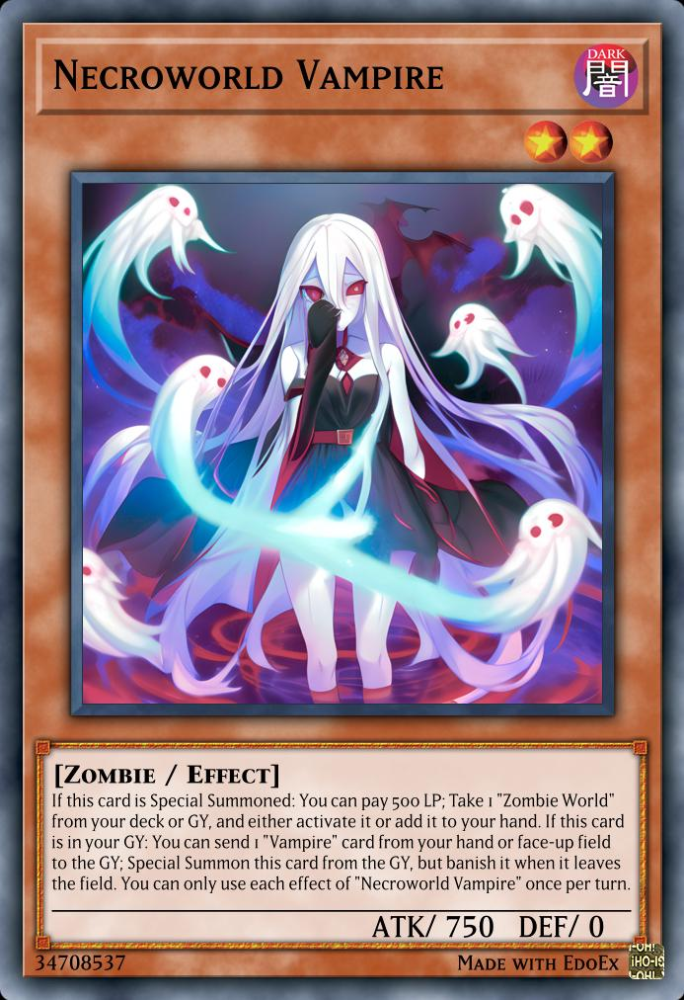
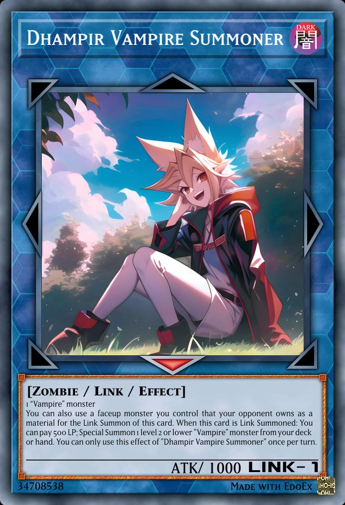

# List of cards

### Necroworld Vampire (34708537)

A support for the Vampire Archetype. It's a searcher for [Zombie World](https://yugipedia.com/wiki/Zombie_World) that is basically a fusion of [Metaverse](https://yugipedia.com/wiki/Metaverse), [Necroworld Banshee](https://yugipedia.com/wiki/Necroworld_Banshee) and [Vampire Familiar](https://yugipedia.com/wiki/Vampire_Familiar).

### Dhampir Vampire Summoner (34708538)

The Link monster Vampires needed for so long. Searches any vampire card by summoning [Vampire Familiar](https://yugipedia.com/wiki/Vampire_Familiar) or [Vampire Retainer](https://yugipedia.com/wiki/Vampire_Retainer) or searches a [Zombie World](https://yugipedia.com/wiki/Zombie_World) if summoning [Necroworld Vampire](#necroworld-vampire-34708537). Also sends a monster to GY so if using a searcher you can Special Summon it from the GY to search another card.
